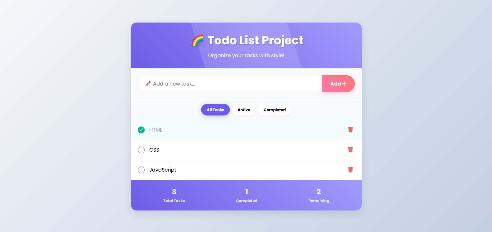
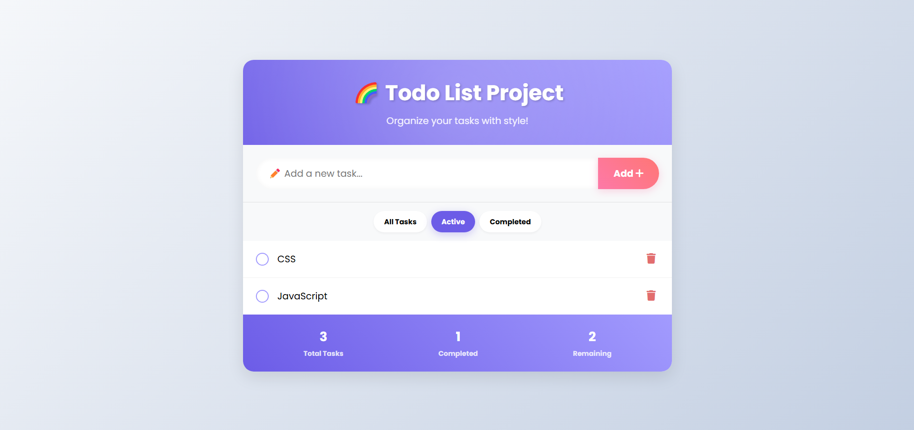
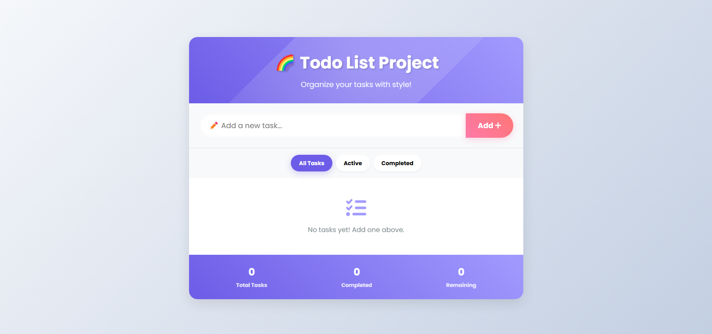

# 🌈 Todo List Project

A **colorful, animated, and fully responsive** todo list application with interactive features and local storage persistence.

### 💻 Live Demo : https://iamarpisaha.github.io/to-do-list/

  
  


## ✨ Features

- 🎨 **Vibrant UI** with gradient colors and smooth animations
- 📝 **Add, edit, complete, and delete** tasks
- 🔍 **Filter tasks** by All/Active/Completed
- 📊 **Real-time statistics** showing task completion
- 💾 **Local storage** - tasks persist after page refresh
- 📱 **Fully responsive** design works on all devices
- 🎭 **Interactive elements** with hover and click effects
- 🌀 **Animated transitions** for a delightful experience

## 🛠️ Technologies Used

- **HTML5** - Semantic markup
- **CSS3** - Styling with animations and transitions
- **JavaScript** - Interactive functionality
- **Font Awesome** - Icons
- **Google Fonts** - Poppins font family
- **Local Storage** - Data persistence

## 🚀 Getting Started

1. **Clone the repository**:

   ```bash
   git clone https://github.com/your-username/todo-list-project.git
   ```

2. **Open the project**:

   - Navigate to the project folder
   - Open `index.html` in your browser

3. **Start using it**:
   - Add tasks using the input field
   - Mark tasks as complete by clicking the checkbox
   - Delete tasks with the trash icon
   - Filter tasks using the control buttons

## 📝 Code Structure

```
todo-list-project/
├── index.html          # Main HTML file
├── README.md           # This documentation file
└── (optional)/
    ├── css/
    │   └── style.css   # CSS styles if separated
    └── js/
        └── script.js   # JavaScript if separated
```

## 🎨 Design Highlights

- Gradient headers and buttons
- Custom animated checkboxes
- Floating bubble background animation
- Task items that slide on hover
- Rotating delete button animation
- Bouncing empty state animation
- Custom scrollbar styling

## 🤝 Contributing

Contributions are welcome! Please follow these steps:

1. Fork the project
2. Create your feature branch (`git checkout -b feature/AmazingFeature`)
3. Commit your changes (`git commit -m 'Add some AmazingFeature'`)
4. Push to the branch (`git push origin feature/AmazingFeature`)
5. Open a Pull Request

## 📜 License

This project is not licensed under the MIT License.

## 🙏 Acknowledgments

- Inspired by modern web design trends
- Font Awesome for beautiful icons
- Google Fonts for the Poppins typeface
- All open source contributors

---

Made with ❤️ by ARPI SAHA  
🔗 https://iamarpisaha.github.io/to-do-list/(#) | 💻 https://github.com/iamarpisaha/to-do-list(#)
